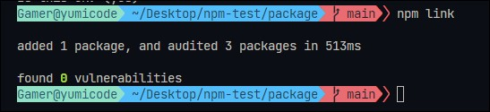
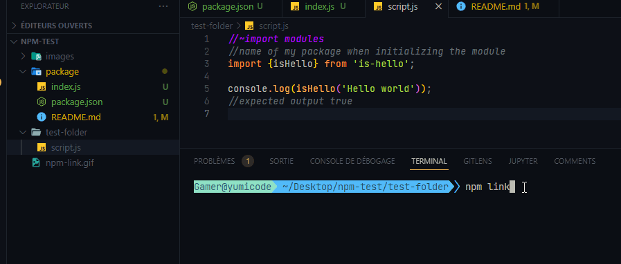
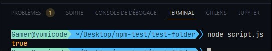

# Create npm package

## Introduction

This is my first npm package testing if the string is "Hello World" or not.
Simple package made with NodeJS

## How to

Open a folder with 2 new folder :

- package
- test-folder

### Initialize folder package wth git

It adds a README file to give all informations about the package

### Package JSON
```js
{ "type": "module",
  "name": "is-hello",
  "version": "1.0.0",
  "description": "Is the string Hello World?",
  "main": "index.js",
  "scripts": {
    "test": "echo \"Error: no test specified\" && exit 1"
  },

  "repository": {
    "type": "git",
    "url": "git+https://github.com/helene-nguyen/npm-package-test.git"
  },

  "keywords": [
    "Hello"
  ],

  "author": "yumicode - with Web Dev Simplified",
  "license": "ISC",
  "bugs": {
    "url": "https://github.com/helene-nguyen/npm-package-test/issues"
  },
  "homepage": "https://github.com/helene-nguyen/npm-package-test#readme"
}
```

### Create index.js 

```js
function isHello(string) {
    return string === "Hello World";
};

export { isHello };
```

### Link the package to test locally

Write command to link the package to test it locally

```
npm link
```



## Test folder
Create in the test-folder a script.js using the function in the package

In the script.js, we will import our new module created

```js
//~import modules
//name of my package when initializing the module

import {isHello} from 'is-hello';

console.log(isHello('Hello world'));
//expected output true
```

We also have to link the test-folder with our package to create a node_module file

```sh
npm link is-hello
--not npm install is-hello because we test
```



____

DON'T FORGET TO NPM INIT !!!

In the package json,  add "type" :  "module" 

And launch 

```
node script.js
```



Soucre to do that [here](https://www.youtube.com/watch?v=J4b_T-qH3BY)